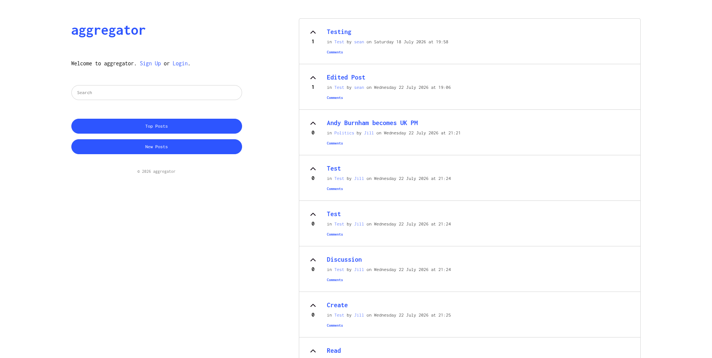

# aggregator

A link aggregator app.

## Setup

Clone the repository and use PHP's development server to run the application: `php -S localhost:8000 -t public`. Set up database using aggregator.sql and set database credentials and BASE_URL in config.php.